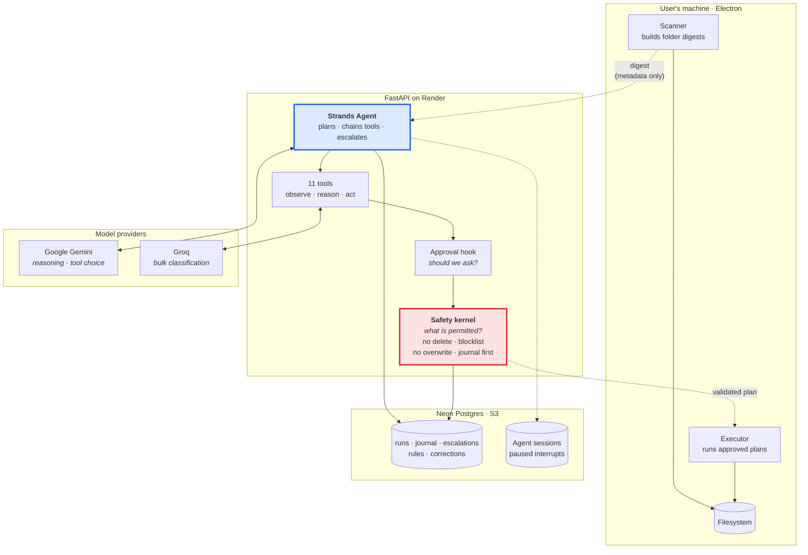

# Mini Manager

**An AI agent that keeps your files in order while you work, and only interrupts you
when it genuinely isn't sure.**

Built with the [Strands Agents SDK](https://strandsagents.com). Mini Manager is not an
app you open and drive: it runs on a schedule, decides what it is confident about,
applies those changes itself, and stops to ask you about anything private or uncertain.
You find the work already done, plus a short list of things it wanted an opinion on.

The agent has eleven tools, chains them without being told the order, and every change it
makes passes through a deterministic safety kernel it cannot reason its way around.

---

## Project Overview

Most file organisers ask you to write rules. Mini Manager reads the folder instead, works
out what each file is, and decides, per file, whether it should act or ask.

That decision is the product. A confidence score is not a badge on a list here; it is the
threshold at which a human gets interrupted. Above it the agent applies the change and
tells you afterwards. Below it, or on anything that looks private, it stops and explains
itself in its own words:

> *"I left your passport scan alone because it is personal identification and I didn't
> want to risk moving something so private."*

Nothing is ever deleted. No operation the agent can emit destroys a file: "delete" moves
it to the Recycle Bin or the Archive, and both can be restored. The only `unlink` left in
the codebase is the second half of a cross-drive move, where the file already exists at its
destination before the source is dropped.

---

## How the agent decides

Every file goes through the same routing, and the thresholds are yours to set:

| Confidence | Sensitivity | What happens |
|---|---|---|
| ≥ 0.85 | none | **Applied.** Reported afterwards. |
| 0.70 to 0.85 | none | **Queued for review.** |
| < 0.70 | any | **Escalated.** Waits for you. |
| any | private | **Escalated.** Confidence is irrelevant: a correct guess about someone's passport is still a decision that belongs to them. |

An autonomous run never blocks on an escalation. It records the question, carries on to
the next folder, and the answer waits for you in Notifications.

---

## The tools

The agent is given capabilities and constraints; it decides the sequence. Asked to tidy a
folder, it typically calls six tools unprompted, including reading your rules and past
corrections before proposing anything.

**Observe** (read-only)
`scan_folder` · `query_files` · `find_stale` · `check_rules` · `recall_corrections`

**Reason** (produce plans, change nothing)
`classify_files` · `check_sensitive` · `propose_changes`

**Act** (every call enters the safety kernel)
`apply_changes` · `quarantine` · `notify_user`

---

## Architecture



**Return-of-control.** The agent reasons on the server; the desktop app executes anything
needing the disk. A hosted backend cannot reach `C:\Users\you\Downloads` and is not meant
to, so the scanner uploads a metadata digest, the agent plans against it, and the kernel
hands back a validated plan for the device to carry out behind its own independent guard.

---

## Safety

Two layers, and the distinction is load-bearing:

**The approval hook decides whether to _ask_.** It is registered, configurable, and
therefore skippable. It may only ever add friction, never grant permission.

**The kernel decides what is _physically permitted_.** It is called unconditionally
inside every acting tool, so a hook that fails to fire cannot produce an unsafe
operation, only an unasked-for one.

The kernel enforces, in this order:

1. **Canonicalise first**: every later check reasons about the resolved path
2. **Blocklist**, on source *and* destination: moving *into* Windows is as bad as out
3. **Scan-root containment**
4. **Extension immutable**: renaming `.pdf` to `.exe` is an attack, not a rename
5. **Never overwrite**: disambiguate with ` (1)`
6. **Path length**, checked last because disambiguation lengthens paths
7. **Journal before execute**: undo exists before the change does

**There is no delete.** Not guarded, not behind a flag: no function in the kernel removes
a file. A test asserts the absence, so it stays true.

---

## What leaves your machine

| | Stays local | Sent to the model | Stored |
|---|---|---|---|
| File contents | Yes | Only on explicit **Explain** | No |
| Text previews (first 400 chars) | No | Plain-text files under 500 KB | No |
| Filenames, sizes, paths | No | Yes, for classification | Against your account |
| `.env`, keys, certificates | **Always** | **Never** | No |

---

## AWS in this architecture

Each AWS service here earns its place by solving a problem the design actually has. None
were added for the logo.

### Strands Agents SDK: the agent itself

AWS's open-source agent framework is not a wrapper around this application; it *is* the
application's control flow. The SDK provides:

- **The agent loop.** Tool selection is the model's decision, not a dispatch table we
  wrote. Given "tidy up my Downloads", the agent chains six tools unprompted, including
  reading the user's rules and past corrections before proposing anything. We specify
  capabilities and constraints; it decides sequence.
- **Tool definitions as prompts.** The `@tool` decorator derives each tool's schema from
  its docstring and type hints, which makes those docstrings prompt engineering rather
  than commentary. They are written as instructions to a model.
- **Lifecycle hooks.** `BeforeToolCallEvent` is where the approval layer lives. It
  inspects every mutating call before it executes and decides whether a human is asked.
- **Interrupts.** `event.interrupt()` genuinely pauses the agent mid-tool-call. The user's
  answer resumes it from that point rather than restarting the goal, which is what makes
  human-in-the-loop a first-class path here rather than a retry.
- **Streaming.** `stream_async` emits `current_tool_use` as tools actually execute, so the
  interface shows real work rather than narration.

### Amazon S3: what makes autonomy survive reality

This is the least glamorous integration and the one the product would break without.

An escalation raised by a scheduled run has nobody watching it. The agent pauses, and that
paused state has to outlive the process. Render recycles containers on every deploy, and
its filesystem is ephemeral. Without durable session storage, an autonomous run that
stopped to ask a question would **silently never resume**: no error, no log, just a
decision nobody is ever offered.

`S3SessionManager` holds the conversation, agent state, and interrupt state. Proven across
a real process boundary: one Python process runs the chain, hits three private files, is
interrupted, and exits. A **separate interpreter**, given only the session id and interrupt
id (and deliberately *not* given the folder digest), restores 16 messages and the
four-file proposal from S3, answers the interrupt, and continues from the paused tool call.

A misconfigured S3 backend is a **startup failure**, not a fallback to local files. Falling
back would pass every test and fail only in production, months later, invisibly.

**Two models, two jobs.** Gemini does the agent's reasoning: which tool to call, whether
to escalate, and the sentence it writes about a passport scan. Groq does the bulk
classification underneath `classify_files`: hundreds of files per run, chunked by
serialised size with backoff on rate limits, where throughput matters more than reasoning
depth. The agent never sees that split; it calls one tool.

### Amazon Bedrock and AgentCore: evaluated, not adopted

Both were researched before building, and the honest outcome is worth recording.

**Bedrock** is Strands' default provider. It is not wired into this codebase: there is no
Bedrock code path, and nothing falls back to it. Gemini is the only reasoning provider,
because a working single-provider loop beats a flaky two-provider one on a four-week
timeline. Bedrock is where this would go next, which is not the same as shipping it.

**AgentCore Runtime** was evaluated and deliberately not used. A cloud runtime cannot reach
`C:\Users\you\Downloads`, and this agent's entire purpose is acting on a user's local
files. The return-of-control split (server reasons, device executes) is the architecture
that constraint forces, and it is the right answer regardless of where the reasoning half
is hosted.

---

## Project Layout

```
mini-manager-app/
|-- backend/api/
|   |-- services/
|   |   |-- kernel.py             the safety kernel, every mutation passes here
|   |   |-- agent_tools.py        the 11 tools, with docstrings written as prompts
|   |   |-- autonomous.py         scheduled runs; never blocks on a question
|   |   |-- approval.py           the hook that decides whether to ask
|   |   +-- sessions.py           where a paused agent waits (S3 in production)
|   |-- routers/
|   |   |-- agent_v2.py           the Strands agent, streaming over SSE
|   |   +-- runs.py               scheduling, escalations, run summaries
|   +-- tests/
|-- app/                          Next.js App Router
|   |-- (app)/overview            run summaries: what happened while you were away
|   |-- (app)/notifications       escalations, answered inline
|   +-- (app)/organize            scan and review
|-- components/layout/
|   |-- ai-panel.tsx              chat, streaming real tool calls
|   +-- run-summary.tsx           the agent's account of its own run
|-- lib/
|   |-- agent-stream.ts           SSE client
|   |-- folder-digests.ts         the metadata the agent reasons over
|   +-- scheduler.ts              asks the server whether a run is owed
+-- electron/
    +-- main.js                   filesystem access, executor, notifications
```

---

## What is in this repository

Everything you need to run Mini Manager is here:

* **Source code** for the website (`app/`, `components/`, `lib/`), the backend API
  (`backend/api/`) and the desktop app (`electron/`)
* **Assets**: logos and icons in `public/`, and the desktop app icons in `electron/assets/`
* **Setup instructions**: the steps below
* **Example settings files**: `backend/api/.env.example` and `.env.local.example`

---

## Getting started

These steps are written for Windows, which is what the desktop app is built for.

### What you need

* Node.js 20 or newer
* pnpm (install it with `npm install -g pnpm`)
* Python 3.13
* A PostgreSQL database. A free [Neon](https://neon.tech) database works.
* An API key from [Google Gemini](https://aistudio.google.com) and one from [Groq](https://console.groq.com)

### Steps

**1. Download the code**

```bash
git clone https://github.com/DrGitman/Mini-Manager.git
cd Mini-Manager
```

**2. Install the website and desktop app packages**

Use pnpm, not npm. This project does not install correctly with npm.

```bash
pnpm install
```

**3. Install the backend**

```bash
python -m venv backend/api/.venv
backend/api/.venv/Scripts/python.exe -m pip install -r backend/api/requirements.txt
```

**4. Add your settings**

Copy the two example files, then open each copy and fill in your own values.

```bash
copy backend\api\.env.example backend\api\.env
copy .env.local.example .env.local
```

**5. Start the app**

```bash
pnpm dev:all
```

This starts the website at http://localhost:3000 and the API at http://localhost:8000.
The database tables are created for you the first time the backend starts.

**6. Open the desktop app (optional)**

Keep the backend running with `pnpm backend` in one terminal, then run this in another:

```bash
pnpm electron:dev
```

**7. Build the Windows installer (optional)**

```bash
pnpm electron:build
```

The installer is saved in `dist-electron/`. This needs Windows Developer Mode turned on,
or a terminal opened as administrator.

---

## Settings

### Backend: `backend/api/.env`

| Name | What it is for | Needed |
|---|---|---|
| `DATABASE_URL` | Your PostgreSQL connection string | Yes |
| `JWT_SECRET` | A long random string that signs login tokens | Yes |
| `GEMINI_API_KEY` | The agent's reasoning | Yes |
| `GROQ_API_KEY` | Sorting large numbers of files | Yes |
| `FRONTEND_URL` | The website address, so the API accepts its requests | Yes |
| `GEMINI_MODEL`, `GROQ_MODEL` | Change which models are used | No |
| `SESSION_BACKEND` | `file` on your own computer, `s3` when hosted | No |
| `SESSION_S3_BUCKET`, `SESSION_S3_REGION` | The S3 bucket where a paused agent waits | Only with `s3` |
| `AWS_ACCESS_KEY_ID`, `AWS_SECRET_ACCESS_KEY` | Access to that bucket | Only with `s3` |
| `SMTP_HOST`, `SMTP_PORT`, `SMTP_USER`, `SMTP_PASSWORD`, `SMTP_FROM` | Email for run summaries and alerts | No |
| `GOOGLE_CLIENT_ID`, `GOOGLE_CLIENT_SECRET` | Sign in with Google | No |

When the backend is hosted on Render, set `SESSION_BACKEND` to `s3`. Render clears its disk
on every deploy, so an agent waiting for your answer in a file would be lost.

### Website: `.env.local`

| Name | What it is for | Needed |
|---|---|---|
| `NEXT_PUBLIC_API_URL` | The backend address, for example `http://localhost:8000` | Yes |
| `NEXT_PUBLIC_SITE_URL` | The public website address | No |
| `NEXT_PUBLIC_SUPPORT_EMAIL` | The email shown on support links | No |

---

## Built With

**AWS**

- **[Strands Agents SDK](https://strandsagents.com)**: the agent loop, tool calling,
  lifecycle hooks, interrupts, and streaming. The control flow of the application.
- **Amazon S3**: durable agent sessions, so an escalation raised by an unattended run
  survives a deploy and can still be answered.

Amazon Bedrock and AgentCore were evaluated and are **not** part of the shipped system.
See [evaluated, not adopted](#amazon-bedrock-and-agentcore-evaluated-not-adopted) for why.

**Model providers**

- **Google Gemini**: the agent's reasoning, meaning which tool to call next, when to escalate,
  and the prose it writes about its own decisions
- **Groq**: bulk file classification. Hundreds of files per run in chunked batches, where
  throughput matters more than reasoning depth

**Everything else**

- **FastAPI** · **Neon Postgres** · **Next.js** · **Electron** · **Tailwind**

---

## Pre-existing work


Development on this repository began on **6 August 2026**. The file scanner, classification
pipeline, undo journal, authentication and user interface were built between 6 and 18
August 2026, and the first four days of that fall before the submission period opened on
10 August.

Work carried out during the submission period covers the Strands Agents integration: the
agent loop and its tool layer, the safety kernel extraction, the human-in-the-loop
escalation path, autonomous scheduled runs, and the streaming interface. The file engine
that predates it is infrastructure the agent operates rather than part of the agent
itself.

---

## License

Mini Manager is open source under the **MIT License**. You are free to use, change and
share the code. The full text is in the [LICENSE](LICENSE) file, and GitHub shows it as
"MIT license" in the About section of this repository.
